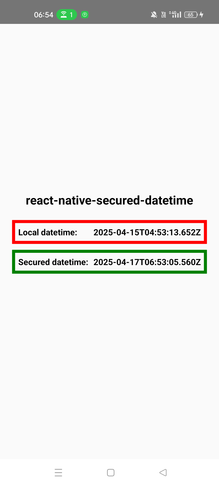

# react-native-secured-datetime

[](https://github.com/nicolastorre/react-native-secured-datetime/actions/workflows/ci.yml)

Securely compute the current date and time using a trusted server datetime and the device's native monotonic clock (`elapsedRealtime`).

This prevents cheating or manipulation of time by tampering with the system clock.

---

<p align="center">
  
</p>

## 🚀 Features

- ✅ Returns a secure `Date` object based on a known server datetime and native uptime
- ✅ Cross-platform: Android & iOS native support
- ✅ Lightweight: No external dependencies
- ✅ Ideal for validating timestamps in sensitive apps (games, attendance, finance...)

---

## 📦 Installation

```bash
npm install react-native-secured-datetime
# or
yarn add react-native-secured-datetime
```

### iOS only

```bash
cd ios && pod install
```

## 🛠 Usage

```js
import {
  getSecuredDateTime,
  getElapsedRealtime,
} from 'react-native-secured-datetime';

const example = async () => {
  try {
    // 1. Fetch server time from a trusted source
    const res = await fetch(
      'https://timeapi.io/api/Time/current/zone?timeZone=Europe/Paris'
    );
    const data = await res.json();
    const serverDateTime = data.dateTime;

    // 2. Capture current uptime when server time is received
    const elapsedAtFetch = getElapsedRealtime();

    // 3. Later on, reconstruct the current secured datetime
    const secureNow = getSecuredDateTime(serverDateTime, elapsedAtFetch);

    console.log('Secured date time:', secureNow.toISOString());
  } catch (err) {
    console.error(err);
  }
};
```

## 🧩 API

getElapsedRealtime(): number
Returns the number of seconds (as a float) since the device booted — not affected by system clock changes.

getSecuredDateTime(serverDateTime: string | Date, oldElapsedRealtime: number): Date
Computes the current secure Date by applying the time difference to the original trusted server time.

## 🧱 How it works

This module:

Takes a server datetime T₀ and the uptime at that moment U₀

Later, measures the new uptime U₁

Computes:

```
T₁ = T₀ + (U₁ - U₀)
```

This ensures accurate and manipulation-proof time calculation, based on monotonic system clocks.

## 🛡 Use Cases

- Games & anti-cheat systems

- Attendance & check-in validation

- Offline secure time tracking

- Finance or digital contract timestamping

## 📜 License

MIT © 2025 – nicolastorre
